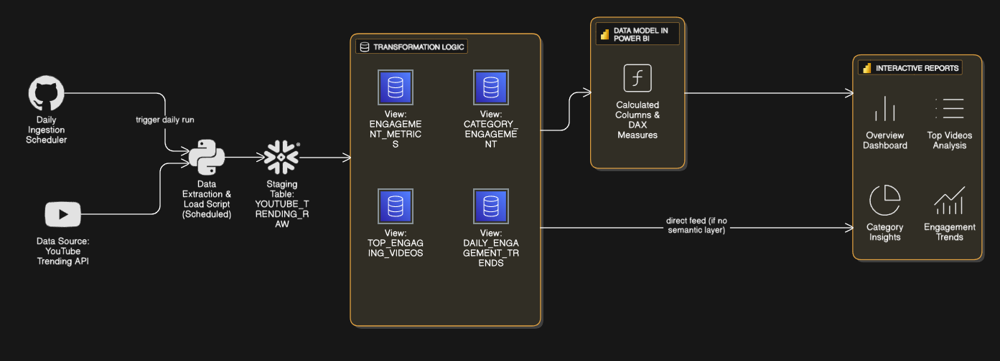

# 📊 YouTube Trending Data Pipeline & Dashboard

## 🌟 Overview
This project builds an end-to-end data pipeline that extracts YouTube trending video data from the YouTube Data API, enriches it with category metadata, stores it in Snowflake, and visualizes key insights using Power BI.

---

## 🚀 Features
- 📥 **Data Ingestion:** Fetches trending videos and category metadata from YouTube API.
- ❄️ **Data Storage:** Raw and dimension data stored in Snowflake tables.
- 🧪 **Data Transformation:** Enriches raw video data by joining with category mappings.
- 📈 **Visualization:** Interactive Power BI dashboard showcasing video trends, engagement metrics, and category insights.
- ⚙️ **Automation Ready:** Modular Python scripts enable easy scheduling and automation.

---

## 🧱 Architecture



```
YouTube API → Raw Data (Snowflake RAW schema)
         → Category Data (Snowflake DIM schema)
         → Enriched Data (Snowflake TRANSFORMED schema)
         → Power BI Dashboard
```

---

## 🧰 Prerequisites
- Python 3.x
- Snowflake account with proper access and warehouse
- YouTube Data API key
- Power BI Desktop
- `.env` file with the following variables:
  ```
  YOUTUBE_API_KEY=your_youtube_api_key
  SNOWFLAKE_USER=your_snowflake_user
  SNOWFLAKE_PASSWORD=your_snowflake_password
  SNOWFLAKE_ACCOUNT=your_snowflake_account
  ```

---

## ⚙️ Installation & Setup

1. Clone this repo:
   ```
   git clone https://github.com/yourusername/youtube-trending-pipeline.git
   cd youtube-trending-pipeline
   ```

2. Create and activate a virtual environment:
   ```bash
   python -m venv venv
   source venv/bin/activate       # On Windows: venv\Scripts\activate
   ```

3. Install dependencies:
   ```bash
   pip install -r requirements.txt
   ```

4. Create a `.env` file in the root folder and add your credentials.

---

## 🧪 Usage

### 1. 📥 Fetch Raw YouTube Trending Data
```bash
python script_1_fetch_and_load_youtube.py
```

### 2. 📂 Fetch & Load Category Metadata
```bash
python fetch_and_load_yt_categories.py
```

### 3. 🔄 Enrich Raw Data with Category Names
```bash
python script_2_transform_enrich
```
### 4. 🔄 All-in-one run script to run all the scripts above automatically
```bash
python run_scripts.py
```

### 4. 📊 Visualize in Power BI
- Connect to the `YOUTUBE_DB.TRANSFORMED.YOUTUBE_TRENDING_ENRICHED` table
- Build or use the provided Power BI report file to visualize insights

---

## 📌 Power BI Dashboard Highlights
- Total videos, views, average engagement
- Top trending videos with engagement metrics
- Category-wise performance analysis
- Daily trends and engagement over time

---

## 🔮 Future Improvements
- Automate the pipeline with Airflow or other orchestration tools
- Add sentiment analysis on comments using NLP
- Enhance dashboard with predictive analytics

---

## 📄 License
MIT License

---

## 👤 Contact
**Rohil Mogal**  
📧 Email: rohilmogal12@gmail.com  
🌐 Portfolio: [rohilytics.github.io/my-portfolio](https://rohilytics.github.io/my-portfolio)  
💼 LinkedIn: [linkedin.com/in/rohilmogal](https://linkedin.com/in/rohilmogal)
